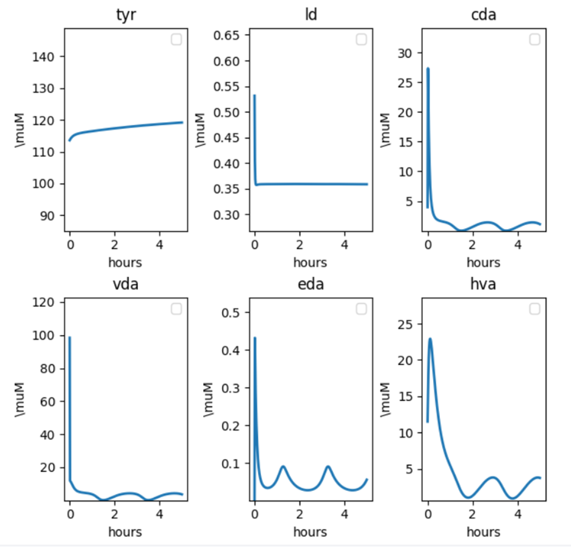
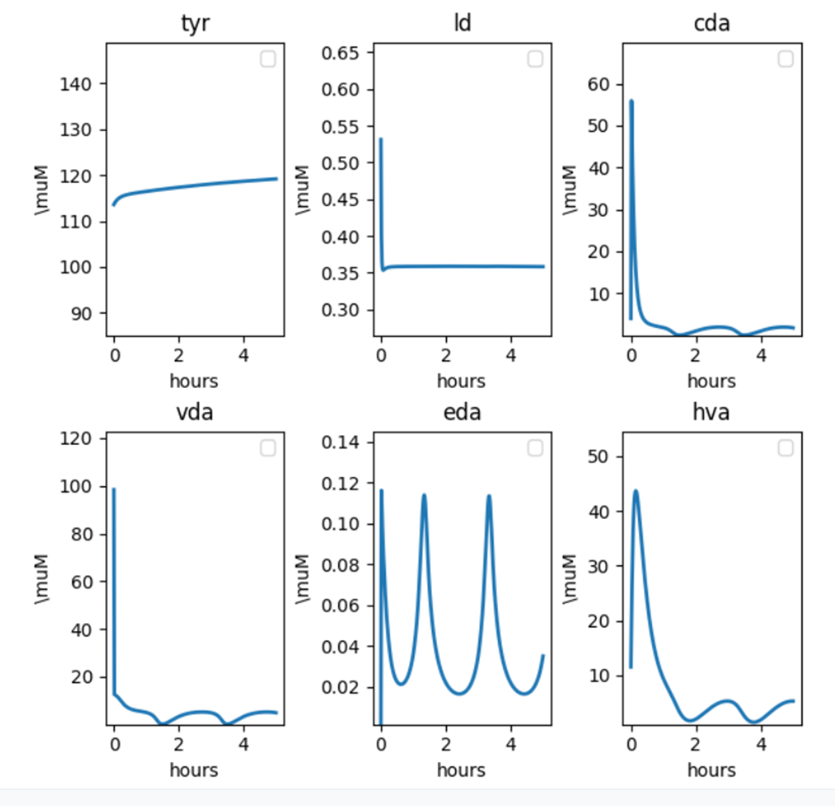
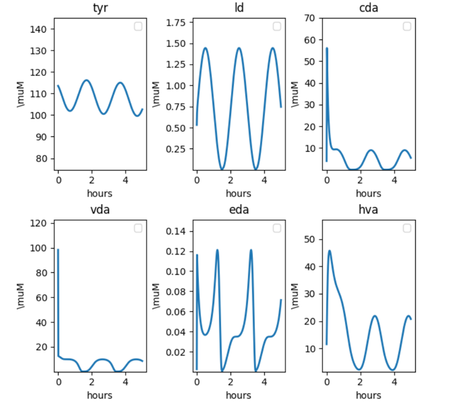
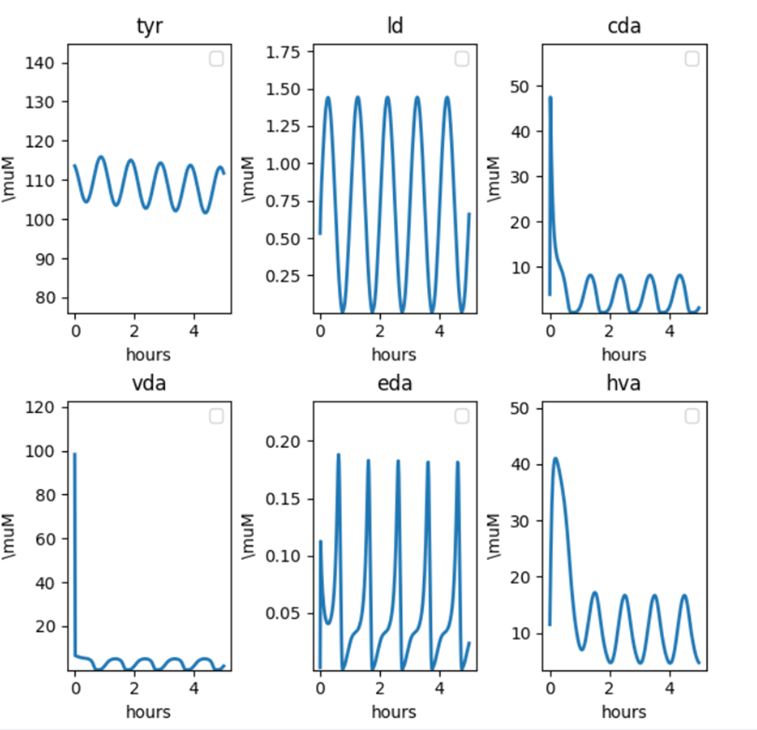

## Plots: Periodic enzyme velocity in dopamine pathway

VDAT is periodic, VDAT=a * sin(2pi * t / Tau)+b, a=1, b=1, Tau=2, firing=500

VDAT is periodic, Amplitude = 2, b=2, Tau =2, firing=500

Both VTH and VDAT are periodic, both scaled with amplitude=2, b=2, Tau=2, firing=500

Tau=1 from last plot; need to turn up firing rate to 1000

 (Both VTH and VDAT are periodic, both scaled with amplitude=2, b=2, Tau=1, firing=1000)

 

\# TODO: amplitude vs period plot

\# if both enzymes are periodic at different periods, the longer period dictates the behavior, but then the scale of these fluctuations also matters.

 